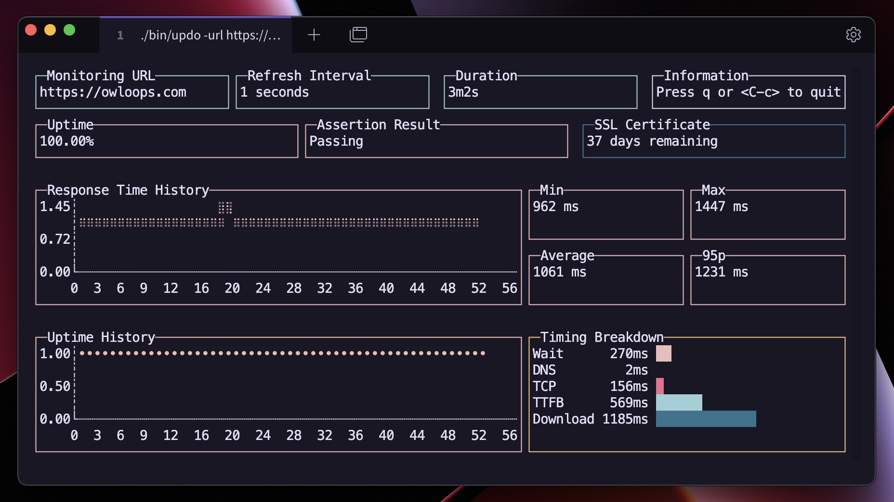

<div align="center">

# 🐤 Updo - Website Monitoring Tool

<p align="center">
  
</p>

Updo is a command-line tool for monitoring website uptime and performance. It provides real-time metrics on website status, response time, SSL certificate expiry, and more, with alert notifications.


[](https://github.com/Owloops/updo/releases/latest)
</div>

## Features

- Real-time monitoring of website uptime and performance
- Displays various metrics like uptime percentage, average response time, and SSL certificate expiry
- Desktop alert notifications for website status changes
- Customizable refresh intervals and request timeouts
- Supports HTTP and HTTPS, with options to skip SSL verification
- Assertion on response body content
- Command-line interface with simple usage
- Simple mode with fancy or plain text output
- Automatic terminal capability detection

## Demo

<https://github.com/Owloops/updo/assets/17541283/5edd2eb1-af81-4b88-96e2-643c80d46aca>

## Installation

<details>
<summary>Quick install script (Linux, macOS, Windows/MSYS)</summary>

#### One-line install command

```bash
curl -sSL https://raw.githubusercontent.com/Owloops/updo/main/install.sh | bash
```

This script automatically:

- Detects your OS and architecture
- Downloads the latest release
- Makes the binary executable
- Installs to /usr/local/bin (or ~/.local/bin if permission denied)
- Removes quarantine attribute on macOS

</details>

<details>
<summary>Download executable binaries</summary>

#### You can download executable binaries from the latest release page

> [](https://github.com/Owloops/updo/releases/latest)
</details>

<details>
<summary>Build from source</summary>

#### You can install Updo by cloning the repository and building the binary

Make sure your system has Go [installed](https://go.dev/doc/install).

> ```bash
> git clone https://github.com/Owloops/updo.git
> cd updo
> go build
> ```
>
#### Build with version information

To include version information in the binary, use ldflags:

```bash
go build -ldflags="-X 'main.version=v1.0.0' -X 'main.commit=$(git rev-parse HEAD)' -X 'main.date=$(date)'"
```

Check the version with:

```bash
./updo --version
```

#### Another way to install it if you have go in your machine just

```sh
GOBIN="absolute_path_where_you_want_binaries_to_be_installed" go install github.com/Owloops/updo@latest
```

</details>

> [!NOTE]  
> You may get a warning message on Windows and MacOS, which is discussed in this issue <https://github.com/Owloops/updo/issues/4>
>
> ### macOS Security
>
> macOS may prevent running downloaded binaries due to security measures. If you get a warning message like "cannot be opened because the developer cannot be verified", you can remove the quarantine attribute with this command:
>
> ```bash
> xattr -d com.apple.quarantine /path/to/updo
> ```
>
> Replace `/path/to/updo` with the actual path to the downloaded binary (e.g. `~/Downloads/updo_Darwin_arm64/updo`)

## Usage

Run Updo using the following command:

```bash
# Basic usage
./updo monitor [options] <website-url>

# Alternative syntax using --url flag
./updo monitor --url <website-url> [options]

# Generate shell completions
./updo completion bash > updo_completion.bash
```

### Docker

You can run Updo using Docker:

```console
# Build Docker image from locally cloned repo
docker build -t updo .
# ... or build straight from repo URL (no cloning needed):
docker build -t updo https://github.com/Owloops/updo.git

# And now you can run Updo from the built image:
docker run -it updo monitor [options] <website-url>
# Or with the --url flag:
docker run -it updo monitor --url <website-url> [options]
```

### Options

- `-u, --url`: URL of the website to monitor
- `-r, --refresh`: Refresh interval in seconds (default: 5)
- `-f, --should-fail`: Invert status code success (default: false)
- `-t, --timeout`: HTTP request timeout in seconds (default: 10)
- `-l, --follow-redirects`: Follow redirects (default: true)
- `-s, --skip-ssl`: Skip SSL certificate verification (default: false)
- `-a, --assert-text`: Text to assert in the response body
- `-n, --receive-alert`: Enable alert notifications (default: true)
- `--simple`: Use simple output instead of TUI
- `--no-fancy`: Disable fancy terminal formatting in simple mode
- `-H, --header`: HTTP header to send (can be used multiple times, format: 'Header-Name: value')
- `-c, --count`: Number of checks to perform (0 = infinite)
- `-h, --help`: Display help message

### Examples

```bash
# Basic monitoring with defaults (URL as argument)
./updo monitor https://example.com

# Alternative syntax using --url flag
./updo monitor --url https://example.com

# Root command with --url flag (implicit monitor command)
./updo --url https://example.com

# Set custom refresh and timeout
./updo monitor -r 10 -t 5 https://example.com

# Use simple mode with a set number of checks
./updo monitor --simple -c 10 https://example.com

# Simple mode with plain text output
./updo monitor --simple --no-fancy https://example.com

# Assert text in the response
./updo monitor -a "Welcome" https://example.com

# Monitoring with custom HTTP headers (long form)
./updo monitor --header "Authorization: Bearer token123" --header "User-Agent: updo-test" https://example.com

# Monitoring with custom HTTP headers (short form)
./updo monitor -H "Authorization: Bearer token123" -H "Content-Type: application/json" https://example.com
```

## Keyboard Shortcuts

- `q` or `Ctrl+C`: Quit the application

## Mentions

- [awesome-readme](https://github.com/matiassingers/awesome-readme)
- [termui](https://github.com/gizak/termui)
- [Terminal Trove](https://terminaltrove.com/updo)
- [cobra](https://github.com/spf13/cobra)
- [bubbletea](https://github.com/charmbracelet/bubbletea)

## Contributing

Contributions to Updo are welcome! Feel free to create issues or submit pull requests.

## License

This project is licensed under the [MIT License](LICENSE).
